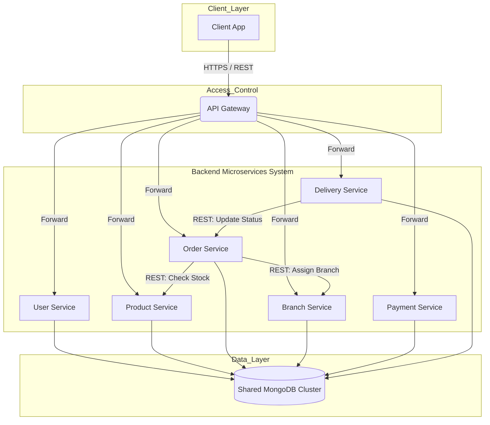

#  FoodFast Delivery - Hệ thống Giao Món Ăn Bằng Drone

[-orange)](https://restfulapi.net/)

> **Đồ án môn Công nghệ Phần mềm - Nhóm 14**
>
> Hệ thống đặt và giao món ăn trực tuyến (Cơm Tấm, Phở, Cà phê sữa...) tích hợp công nghệ giao hàng bằng **Drone**, với kiến trúc Microservices linh hoạt và trải nghiệm người dùng đồng nhất.

---

##  Giới thiệu Dự án
**FoodFast Delivery** cung cấp giải pháp đặt món ăn nhanh chóng, giải quyết các vấn đề về quy trình giao vận phức tạp. Hệ thống tập trung vào tính ổn định và khả năng tích hợp chặt chẽ giữa các dịch vụ thông qua giao thức chuẩn RESTful API.

###  Mục tiêu chính
* **Trải nghiệm nhất quán:** Đồng bộ dữ liệu hoàn hảo giữa Web App (ReactJS) và Mobile App (React Native).
* **Vận hành tự động:** Quy trình kiểm tra tồn kho, gán chi nhánh và tạo đơn vận chuyển được xử lý tự động qua API.
* **Quản lý tập trung:** Sử dụng Shared Database để đảm bảo tính nhất quán dữ liệu cao nhất cho các nghiệp vụ cốt lõi.

---

##  Kiến trúc Hệ thống 

Hệ thống được xây dựng theo kiến trúc **Microservices RESTful**, trong đó các dịch vụ giao tiếp trực tiếp với nhau thông qua HTTP Request (Đồng bộ). Mọi yêu cầu từ phía người dùng đều được kiểm soát và điều hướng qua **API Gateway**.

### Sơ đồ Component
*(Mô phỏng lại dựa trên thiết kế thực tế của nhóm)*

## Công nghệ sử dụng

| Hạng mục | Công nghệ | Chi tiết |
| :--- | :--- | :--- |
| **Backend** | Spring Boot (Java) | Framework chính để xây dựng Microservices. |
| **Frontend** | ReactJS, React Native | Web Dashboard cho Admin và Mobile App cho User. |
| **Database** | **MongoDB** | Cơ sở dữ liệu NoSQL dùng chung (Shared Database). |
| **Architecture**| Microservices | Kiến trúc hướng dịch vụ với giao tiếp RESTful. |
| **Authentication**| JWT (JSON Web Token) | Xác thực và phân quyền tập trung tại Gateway. |
| **Payment** | VNPay | Tích hợp cổng thanh toán điện tử. |
| **DevOps** | Docker | Đóng gói ứng dụng để triển khai nhất quán. |

---

## Các Microservices Chính
Hệ thống bao gồm 6 dịch vụ nghiệp vụ cốt lõi:

* **User Service:** Quản lý đăng ký, đăng nhập và hồ sơ cá nhân.
* **Product Service:** Quản lý danh mục món ăn và cung cấp API kiểm tra tồn kho cho Order Service.
* **Order Service:**
    * Tiếp nhận yêu cầu đặt hàng.
    * Gọi API sang **Product Service** để giữ hàng.
    * Gọi API sang **Branch Service** để tìm cửa hàng phù hợp.
    * Cập nhật trạng thái đơn hàng từ các dịch vụ khác.
* **Branch Service:** Quản lý danh sách chi nhánh và khu vực phục vụ.
* **Payment Service:** Xử lý giao dịch với VNPay và ghi nhận lịch sử thanh toán.
* **Delivery Service:** Quản lý quy trình giao vận, trạng thái Drone và cập nhật tiến độ giao hàng về Order Service.

---

## Luồng Nghiệp vụ 

### 1. Quy trình Đặt hàng
Quy trình được thực hiện tuần tự để đảm bảo tính chính xác:

1.  **Client** gửi đơn hàng `->` **API Gateway** `->` **Order Service**.
2.  **Order Service** gọi API `checkStock` sang **Product Service**.
    * *Nếu còn hàng:* Khóa tồn kho tạm thời.
    * *Nếu hết hàng:* Trả về lỗi ngay lập tức.
3.  **Order Service** gọi API sang **Branch Service** để gán đơn cho chi nhánh gần nhất.
4.  Sau khi tạo đơn thành công, Client được chuyển hướng sang **Payment Service** để thanh toán.

### 2. Quy trình Cập nhật Giao vận
* **Delivery Service** chịu trách nhiệm điều phối Drone.
* Khi trạng thái giao hàng thay đổi (VD: `Delivered`), Delivery Service sẽ gọi ngược lại API `updateStatus` của **Order Service** để đồng bộ trạng thái cuối cùng cho người dùng.

---

## Roadmap & Future Features

- [x] Triển khai kiến trúc Microservices cơ bản (REST).
- [x] Tích hợp Shared Database MongoDB.
- [ ] **Phase 2:** Phát triển Notification Service (Thông báo đẩy).
- [ ] **Phase 2:** Tích hợp Message Broker (Kafka/RabbitMQ) để xử lý các tác vụ nền.

---
**Thực hiện bởi Nhóm 14 - CNPM SGU**
